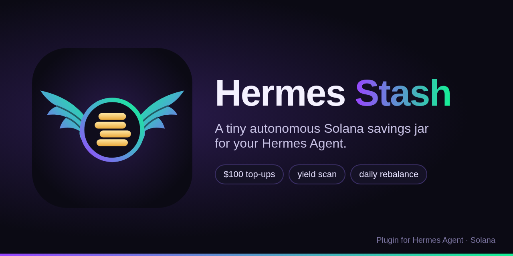
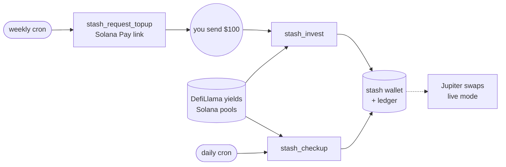

<p align="center">
  
</p>

# Hermes Stash

**A tiny autonomous Solana savings jar for [Hermes Agent](https://github.com/NousResearch/hermes-agent).**

Hermes Stash gives your agent its own Solana wallet and one simple job:

1. Once a week it asks you to top it up with **$100 USDC** (a one-tap Solana Pay link in Telegram).
2. It scans Solana yield aggregators, picks the best boring pools and invests.
3. Once a day it checks the positions and moves money if a pool dropped out or fell behind.

That's it. No dashboards, no tokens, no leverage.

**Videos:** [pitch (1:56)](media/pitch.mp4) · [demo (1:46)](media/demo.mp4)



## How it picks pools

- **Universe:** Solana pools from the [DefiLlama yields](https://defillama.com/yields?chain=Solana) aggregator, which covers Kamino, MarginFi, Jito, Marinade, Sanctum, Drift and others.
- **Filters:** single-asset only, no impermanent-loss risk, TVL of at least $5M, APY between 2% and 40% (anything above is treated as bait).
- **Score:** `APY × log10(TVL)`, so a big pool wins over a tiny one at the same APY.
- **Allocation:** top 3 pools, at most one per protocol, weights by score with a 50% cap per pool.
- **Rebalance:** move a position only when its pool no longer qualifies or the best alternative pays at least 1.5 APY points more.

## Install

```bash
hermes plugins install vladthecto/hermes-stash
hermes plugins enable hermes-stash
```

Then add the two schedules. The easiest way is to ask Hermes from your Telegram chat ("set up my stash schedule"), so reminders come back to that chat. From the terminal:

```bash
hermes cron create "every monday at 10am" "Use the hermes-stash skill: weekly top-up"
hermes cron create "every day at 9am" "Use the hermes-stash skill: daily checkup"
```

On first use the plugin creates a keypair at `~/.hermes/stash/wallet.json` (mode `0600`) and a ledger next to it.

## Tools

| Tool | What it does |
| --- | --- |
| `stash_wallet` | Address, network, mode, SOL and USDC balances |
| `stash_request_topup` | Solana Pay link asking for the weekly top-up |
| `stash_record_deposit` | Marks a top-up as received |
| `stash_scan` | Ranked list of qualifying Solana pools |
| `stash_invest` | Splits idle cash across the top pools |
| `stash_checkup` | Accrues yield, rescans, rebalances |
| `stash_portfolio` | Deposits, positions and PnL (also `/stash`) |

## Settings

Set them in `~/.hermes/config.yaml`:

```yaml
plugins:
  entries:
    hermes-stash:
      network: devnet
      dry_run: true
```

| Key | Default | Meaning |
| --- | --- | --- |
| `network` | `devnet` | `devnet` or `mainnet-beta` |
| `dry_run` | `true` | Paper trading. With `false` on mainnet, swaps go through Jupiter |
| `topup_usd` | `100` | Weekly ask |
| `max_positions` | `3` | Pools to spread across |
| `min_tvl_usd` | `5000000` | Ignore smaller pools |
| `rebalance_threshold` | `1.5` | APY gap that justifies a move |
| `rpc_url` | public RPC | Your own Solana RPC |

**Safe by default.** Out of the box the stash runs on devnet in paper mode: it tracks positions in its ledger and never signs a transaction. Live mode is opt-in, mainnet only, and in v0.1 executes Jupiter swaps into yield-bearing tokens (JitoSOL, mSOL, INF and similar). Lending deposits are tracked on paper for now.

## Try it without Hermes

```bash
pip install -e ".[dev]"
hermes-stash --sample deposit 100   # pretend you topped up
hermes-stash --sample invest        # pick pools and invest
hermes-stash --sample checkup       # daily health check
hermes-stash scan                   # live scan from DefiLlama
pytest -q
```

`--sample` uses the bundled snapshot in `examples/pools.sample.json` instead of the live API.

## Layout

```
plugin.yaml          Hermes manifest
__init__.py          plugin entry point
plugin.py, tools.py  tool registration and JSON handlers
schemas.py           tool schemas shown to the model
skills/hermes-stash  the skill Hermes follows on each cron run
stash/               the actual logic: wallet, yields, strategy, ledger, executor
tests/               strategy and end-to-end tests
```

## Disclaimer

Experimental software built for the Colosseum hackathon. Not financial advice. Keep only what you are happy to lose in the stash wallet.

## License

[MIT](LICENSE)
